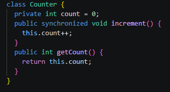

# Parte 1
## Shared Counter
Foi pedido para analisar o código [SharedCounter](SharedCounter.java) disponibilizado no material da aula 27.

O código usa threads para incrementar um mesmo contador ao mesmo tempo com 2 instâncias, cada uma 1000 vezes, tendo que resultar em 2000 no final. Mas isso não acontece 100% das vezes pois algumas vezes as 2 threads tentar incrementar o contador nos exato mesmo tempo e um acaba bloqueando o outro.

Execução sem modificar nada:

Isso pode ser resolvido adicionando a palavra-chave "synchronized" no método de incremento:

O synchronized não deixa uma thread tentar incrementar o contador até que a outra tenha terminado, assim eliminando os resultados diferentes de 2000.

Execução com o synchronized adicionado:

