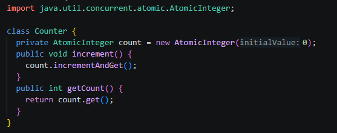
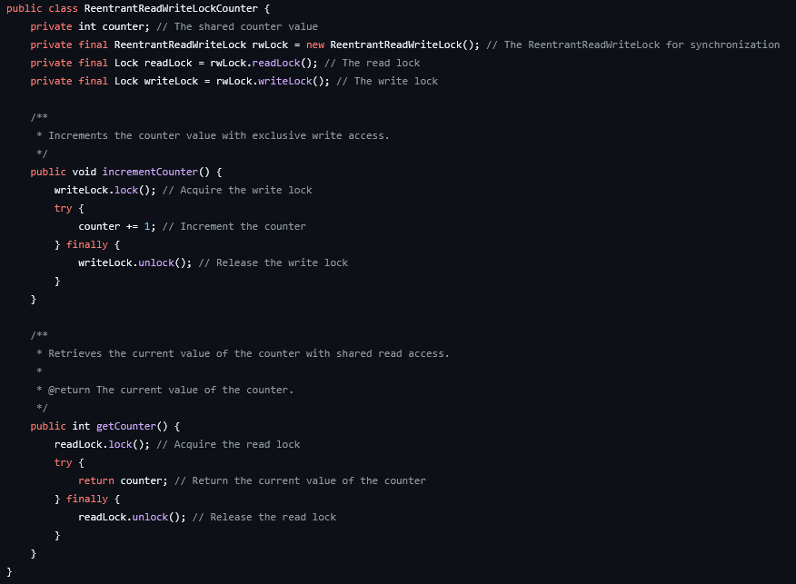

# Parte 1
## Shared Counter
Foi pedido para analisar o código [SharedCounter](SharedCounter.java) disponibilizado no material da aula 27.

O código usa threads para incrementar um mesmo contador ao mesmo tempo com 2 instâncias, cada uma 1000 vezes, tendo que resultar em 2000 no final. Mas isso não acontece 100% das vezes pois algumas vezes as 2 threads tentam incrementar o contador nos exato mesmo momento e um acaba bloqueando o outro.

Execução sem modificar nada:

Isso pode ser resolvido adicionando o recurso de pacote **java.util.concurrent.atomic.AtomicInteger**.

O que esse pacote faz é usar operações atômicas para realizar os cálculos, operações atômicas não podem ser interrompidas, resultando em nenhum incremento sendo bloqueado.

Execução com o pacote adicionado:

# Parte 2
## Lock
Foi pedido para encontrar um código open source que utilizasse algum método de sincronização. Utilizei um [repositório](https://github.com/alxkm/java-concurrency-patterns) que mostra vários métodos de sincronização de códigos concorrentes, decidi usar um [código](https://github.com/alxkm/java-concurrency-patterns/blob/master/src/main/java/org/alxkm/patterns/locks/ReentrantReadWriteLockCounter.java) que utiliza locks:

O lock funciona bloqueando uma variável quando uma thread vai fazer alguma modificação, e libertando ela após concluir, enquanto a variável está no lock as outras threads ficam em espera até ela ser libertada.
